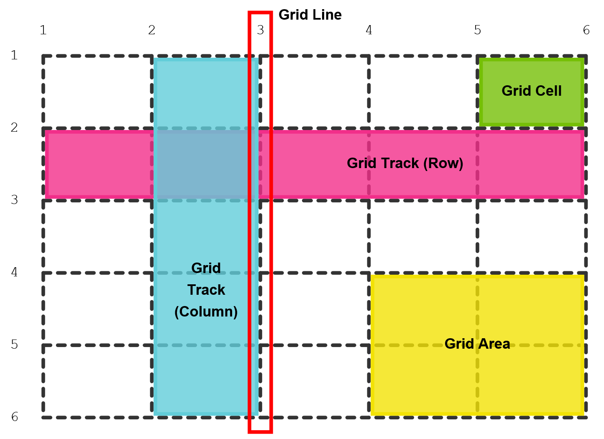
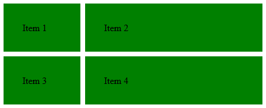

# CSS Grid Layout

The CSS-Grid lets you define a two-dimensional layout of columns and rows. You can then place elements within the grid, which may fill one cell or multiple columns or rows.


## Grid Terminology

- **Grid Container:** The element on which `display: grid` is applied. It's the direct parent of all grid items.
- **Grid Item:** The children of the grid container. Non-direct descendants are **no** grid items.
- **Grid Line:** Make up the structure of the grid. Can be vertical or horizontal. Numbered beginning with `1`. The last line also has number `-1`, counting back in.
- **Grid Cell:** Intersection of two rows and columns.
- **Grid Track:** The rows or columns between two grid lines.
- **Grid Area:** One or more adjacent grid cells that define a rectangle.




## A basic grid

Following code creates a 2x2 grid with green items. A grid container always **behaves like a block display element**, filling 100% of the available width. After declaring the grid-template properties, the grid gets filled with the children of the container.

The **length unit `fr` (fraction)** behaves like the `flex-grow` factor in flexbox and slices the grid up into proportional columns or rows. You could also define the columns/rows in this example with  `25%` percent each, but this has two issues: we have to calculate the amount of percent by ourselves and by adding a `grid-grap` we get problems with overflow, as our grid gets wider as `100%`.

```html
<div class="container">
    <div>Item 1</div>
    <div>Item 2</div>
    <div>Item 3</div>
    <div>Item 4</div>
</div>
```

```css
.container {
    display: grid;
    grid-template-columns: 130px 1fr;
    grid-template-rows: 1fr 1fr; 
    grid-gap: 0.5em;
}
.container > * {
    padding: 2em;
    background-color: green;
}
```
Result:




## Positioning Grid Items

Grid items are positioned with `grid-row` and `grid-column`. 

For positioning a grid item in a specific cell you can write something like this:

```
.item {
	grid-column: 2;
    grid-row: 3;
}
```

For **spanning the item over a specific area**, you can write following syntax to take three rows and two columns:

```
.item {
    grid-column: 3 / span 2;
    grid-row: 2 / 5;
}
```

`span` tells the browser how many grid tracks the item should span, without specifying an explicit grid line. As the last grid line in the grid has the number `-1`, we can **span an item all over** e.g. a row track with `grid-column: 1 / -1`.


## Alternate Syntaxes

You can position the items on the grid by naming the **grid lines** or the **grid areas**. The choice between these two and the standard syntax is a matter of preference and also depends on the use case.

In summary, there are three different syntaxes: line numbers, named grid lines, named grid areas.


### Naming Grid Lines

You can give the grid lines a name by  **using bracket syntax**. For *better readability*, you can add *line breaks and indentation*. 
It is best practice to write a name that describes the content in the track next to the grid line. One grid line can have **more than one name** - for example when the line is the end of a specific content *and* the start.

```css
.container {
  grid-template-columns: [grid-start] 40px 50px auto 40px 
      					 [grid-end];
  grid-template-rows: [header-start] 100px 
                      [header-end box-start] 200px 
                      [box-end main-start] 400px 
                      [main-end footer-start] 100px 
                      [footer-end];
}

.item--main {
  grid-column: 2 / grid-end;
  grid-row: main-start / main-end;
}
```

##### -- Named set of grid lines --

When using the `repeat()` function, you can have **multiple lines with the same name**. The example below creates six named lines, alternately named `col-a-start` and `col-b-start` (and the matching "end"-name). We get two columns 3 times, so we have 6 named lines.

To access the lines later (in an item), add a **number after the line-name**, which indicates to **which instance of that line** you refer to. The following CSS places the element starting in the second line named `col-a-start` and ending in the third line named `col-b-end`.

```css
.grid {
  display: grid;
  grid-template-columns: repeat(3, 	[col-a-start] 1fr 
      								[col-a-end col-b-start] 2fr 
      								[col-b-end]);
}

.item {
    grid-column: col-a-start 2 / col-b-end 3;
}
```


### Naming Grid Areas

Instead of using the grid lines, you can use named areas for positioning the items.  This can be done by adding the property `grid-template-areas`. 

It is important that **every named grid area forms a rectangle**. By using a period as a name you can define an **empty grid cell**. 
For better readability, the names are separated with a tab (or a lot of spaces).

````css
.container {
    grid-template-rows: 100px 200px 400px 100px;
    grid-template-columns: repeat(3, 1fr) 200px;    
    grid-template-areas: "  . 	head 	head	. "
                         "box-1 box-2 	box-3 	side"
                         "main  main  	main  	side"
                         "foot  foot  	foot  	foot";
}
````


## Implicit and Explicit Grid

If you are for example working with a large number of items you want to place in a grid or getting an initially undefined number of items from a database, it would not quite possible to place each item explicitly. In such a case it makes more sense to define a grid loosely and **let the placement algorithm fill it** for you.

By using the `grid-template-*` properties, you define the **explicit grid**. But grid items can still be placed outside of these explicit defined grid tracks. Those items will be handled by the **implicit grid**.

The **meaning of the negative numbers is not changed** by the implicit grid. The negative grid-line numbers always refer to the explicit grid.

If we have more grid items than we have space for, CSS automatically adds more tracks to the grid to place the items. Implicit grid tracks have the **size `auto`**, so they grow to the size necessary to fit the content of the grid items.

In this example we define a 2x2 grid and let the placement algorithm fill the remaining places. 

```css
.container {
    display: grid;
    grid-template-rows: repeat(2, 100px);
    grid-template-columns: repeat(2, 300px);
    grid-gap: 30px;
    
    /* height: 1000px;  
       --> if we would define a height, the items in the implicit grid use more height to 			 fill the 1000px
    */    
}
```


#### -- Position auto-placed items --

The items are added as rows per default. We can change how the auto-placed items get flowed into the grid by using the **`grid-auto-flow` property**. For example, `grid-auto-flow: column` will add columns instead of rows. You can also use the keyword `dense` to let the algorithm fill the gaps in the grid, even if this would change the order of some grid items.

The right image would be an example for `grid-auto-flow: row dense` (from MDN):


#### -- Sizing the implicit tracks --

If we want the tracks to have a defined height or width we can use the **properties `grid-auto-rows` and `grid-auto-columns`** and define a specific height (like `200px`) or use the `minmax()` function, to define a size range from a minimum- to a maximum-value

## Grid Examples from Practice

All those examples are implemented in the grid-example-website folder.

#### Creating an Overall Layout (media-queries)

The overall composition of our page should look like this on desktop and on mobile:


To accomplish such a layout, we have to define a column with a **fixed width for the menu** and a column for the content. The menu should switch to the top, when the screen gets smaller.  For the footer, we can just use the `min-content` value.

We can get such a layout with defining it with **template-areas and media-queries**.

```css
.page-container {
    height: 100vh;
    
    display: grid;
    grid-template-columns: 5rem 1fr;
    grid-template-rows: 1fr min-content;
    grid-template-areas:    "menu   content "
                            "footer footer  ";
}

@media only screen and (max-width: 800px) {
    .page-container {
        grid-template-columns: 1fr;
        grid-template-rows: 5rem 1fr min-content;
        grid-template-areas:    "menu"
                                "content"
                                "footer";
    }
}
```


#### Placing a full-bleed content between paragraphs

Sometime, we need to place content that spans all over the width of a site, while the other content stays in the middle.


Research has shown that the **ideal line-length is 65 characters**, so the main column should have a width of 65ch.

To define such a layout, we create **3 columns**: one for the content in the middle and two for the spaces on the right and left side.

We use the **minmax()** function here to keep the content responsive. On small screens, we still have some space (2rem) on the left and right side of the page. Without the minmax() function, the content would not be responsive.

```css
.full-bleed {
    display: grid;
    grid-template-columns:  [full-start] minmax(2rem, 1fr)  
                            [main-start] minmax(min-content, 65ch) 
                            [main-end]  minmax(2rem, 1fr) 
                            [full-end]; 
}

.full-bleed > img {
    grid-column: full-start / full-end;

    width: 100%;
}

.full-bleed > p {
    grid-column: main-start / main-end;

    margin: 2em 0; /* top/bottom margin */
}
```


#### fixed columns that shrink with the viewport

## Links

[CSS Grid Specification (W3C)](https://drafts.csswg.org/css-grid/)

[CSS Tricks - A Complete Guide to Grid](https://css-tricks.com/snippets/css/complete-guide-grid/)

[WebKit Blog - Grid Layout ](https://webkit.org/blog/7434/css-grid-layout-a-new-layout-module-for-the-web/)

[Book: CSS in Depth](https://www.manning.com/books/css-in-depth)

